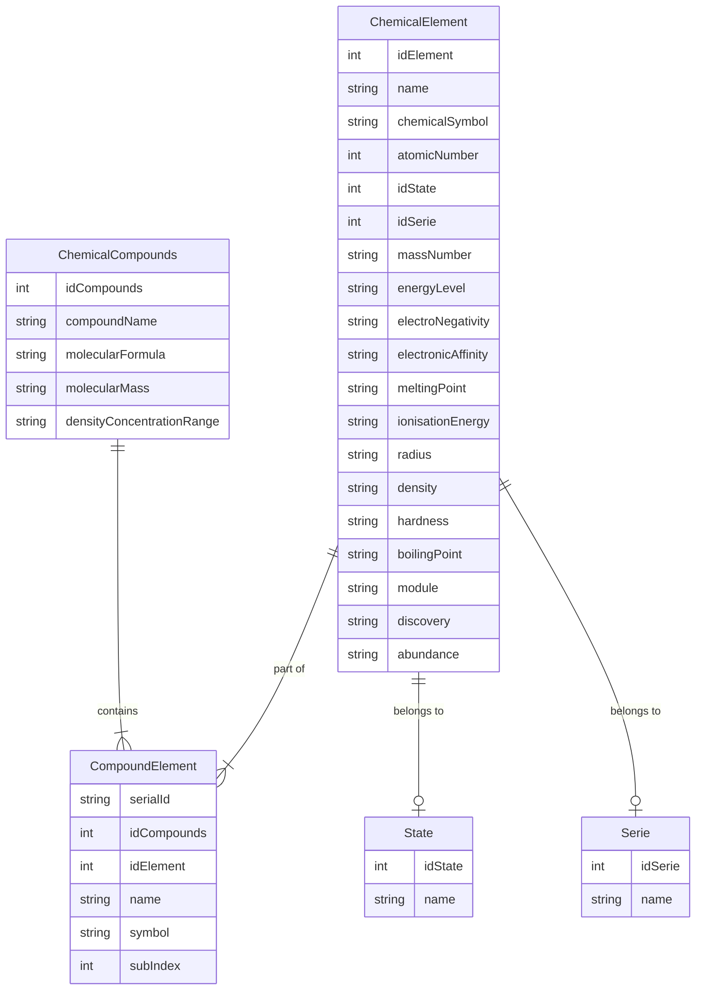

# Práctica JPA-Hibernate

Este proyecto en una adaptación de la práctica JDBC,consiste en un sistema de gestión de datos para la Tabla Periódica, centrado en la información de elementos químicos, series, estados y compuestos.

## Tecnologias utilizados 

- Java: Lenguaje de programación principal del proyecto.
- Java Persistence API (JPA): Especificación de Java que proporciona un conjunto de clases e interfaces para administrar entidades y relaciones en una base de datos relacional.
- Hibernate: Framework de mapeo objeto-relacional (ORM) que implementa JPA y facilita el almacenamiento y recuperación de objetos Java en una base de datos.
- PostgreSQL: Sistema de gestión de base de datos relacional utilizado como backend para almacenar y administrar los datos del sistema.

## Diagrama

## Requisitos
- Java 8 o superior
- Base de datos PostgreSQL instalada y configurada

##  Ejecución

1. **Configuración de la Base de Datos**

   - Crea una base de datos en PostgreSQL para el proyecto.
   - Actualiza la configuración de conexión en: `src/main/resources/META-INF/persistence.xml`. Y en la clase `Main.java`.

2. **Ejecutar el proyecto**
    
    - Ejecuta el archivo: `JPAMagazinesAnnotations-main/src/main/java/Main.java`.
    
3. **Utilizar el Programa**

    - Sigue las instrucciones en la consola para interactuar con el sistema de gestión de base de datos.
    - Puedes realizar operaciones como la creación de tablas, lectura desde archivos CSV y consultas personalizadas.

## Estrategia Utilizada

- El proyecto utiliza Java con JPA e Hibernate para interactuar con la base de datos PostgreSQL.
- Se han implementado controladores específicos (SerieController, EstadoController, ElementoController, CompuestoController, CompuestoElementoController) para gestionar las entidades de la Tabla Periódica.
- La lectura desde archivos CSV se realiza utilizando la biblioteca OpenCSV para garantizar un manejo eficiente de datos.
- El sistema proporciona información detallada en la consola para guiar al usuario durante la ejecución.

## Diseño Tablas

## Tabla de Estructura de la Tabla "estados"

| Column   |          Type          | Collation | Nullable | Default |
|----------|------------------------|-----------|----------|---------|
| idestado | integer                |           | not null |         |
| nombre   | character varying(255) |           |          |         |

Indexes:
    "estados_pkey" PRIMARY KEY, btree (idestado)

Referenced by:
    TABLE "elementos" CONSTRAINT "elementos_idestado_fkey" FOREIGN KEY (idestado) REFERENCES estados(idestado)

## Tabla de Estructura de la Tabla "series"

| Column  |          Type          | Collation | Nullable | Default |
|---------|------------------------|-----------|----------|---------|
| idserie | integer                |           | not null |         |
| nombre  | character varying(255) |           |          |         |

Indexes:
    "series_pkey" PRIMARY KEY, btree (idserie)

Referenced by:
    TABLE "elementos" CONSTRAINT "elementos_idserie_fkey" FOREIGN KEY (idserie) REFERENCES series(idserie)

## Tabla de Estructura de la Tabla "compuestos"

| Column      |          Type          | Collation | Nullable | Default |
|-------------|------------------------|-----------|----------|---------|
| idcompuesto | integer                |           | not null |         |
| nombre      | character varying(255) |           |          |         |
| formula     | character varying(255) |           |          |         |
| masa        | character varying(255) |           |          |         |
| drc         | character varying(255) |           |          |         |

Indexes:
    "compuestos_pkey" PRIMARY KEY, btree (idcompuesto)

Referenced by:
    TABLE "compuestoelemento" CONSTRAINT "compuestoelemento_compuesto_id_fkey" FOREIGN KEY (compuesto_id) REFERENCES compuestos(idcompuesto)

## Tabla de Estructura de la Tabla "compuestoelemento"

| Column          |          Type          | Collation | Nullable |                                     Default                                      |
|-----------------|------------------------|-----------|----------|---------------------------------------------------------------------------------|
| id              | integer                |           | not null | nextval('compuestoelemento_id_seq'::regclass)                                   |
| compuesto_id    | integer                |           |          |                                                                                 |
| nombrecompuesto | character varying(255) |           |          |                                                                                 |
| elemento_id     | integer                |           |          |                                                                                 |
| simboloelemento | character varying(255) |           |          |                                                                                 |
| subindice       | integer                |           |          |                                                                                 |

Indexes:
    "compuestoelemento_pkey" PRIMARY KEY, btree (id)

Foreign-key constraints:
    "compuestoelemento_compuesto_id_fkey" FOREIGN KEY (compuesto_id) REFERENCES compuestos(idcompuesto)
    "compuestoelemento_elemento_id_fkey" FOREIGN KEY (elemento_id) REFERENCES elementos(idelemento)

## Tabla de Estructura de la Tabla "elementos"

| Column      |          Type          | Collation | Nullable | Default |
|-------------|------------------------|-----------|----------|---------|
| idelemento  | integer                |           | not null |         |
| nombre      | character varying(255) |           |          |         |
| simbolo     | character varying(255) |           |          |         |
| peso        | numeric(12,6)          |           |          |         |
| idserie     | integer                |           |          |         |
| idestado    | integer                |           |          |         |
| energia     | character varying(255) |           |          |         |
| en          | numeric(12,6)          |           |          |         |
| fusion      | numeric(12,6)          |           |          |         |
| ebullicion  | numeric(12,6)          |           |          |         |
| ea          | numeric(12,6)          |           |          |         |
| ionizacion  | numeric(12,6)          |           |          |         |
| radio       | integer                |           |          |         |
| dureza      | numeric(12,6)          |           |          |         |
| modulo      | numeric(12,6)          |           |          |         |
| densidad    | numeric(12,6)          |           |          |         |
| cond        | numeric(12,6)          |           |          |         |
| calor       | numeric(12,6)          |           |          |         |
| abundancia  | numeric(12,6)          |           |          |         |
| dto         | integer                |           |          |         |

Indexes:
    "elementos_pkey" PRIMARY KEY, btree (idelemento)

Foreign-key constraints:
    "elementos_idestado_fkey" FOREIGN KEY (idestado) REFERENCES estados(idestado)
    "elementos_idserie_fkey" FOREIGN KEY (idserie) REFERENCES series(idserie)

Referenced by:
    TABLE "compuestoelemento" CONSTRAINT "compuestoelemento_elemento_id_fkey" FOREIGN KEY (elemento_id) REFERENCES elementos(idelemento)

